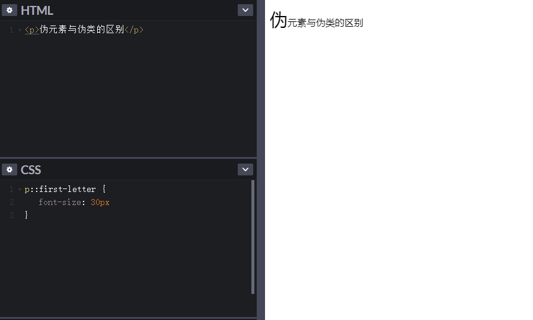

# 基础知识点

## 伪元素

### 概念

伪元素是一个附加至选择器末的关键词，允许你对被选择元素的特定部分修改样式。即会创建一些不在DOM树中的元素，并为其添加样式。用双冒号`::`标识, 但是之前规则不完整，现在有些伪元素也用单冒号`:`标识。

> <font color="green"> 注：一个选择器中只能使用一个伪元素。伪元素必须紧跟在语句中的简单选择器/基础选择器之后。</font >

### 举栗子

```html
<p>伪元素和伪类的区别</p>

p::first-letter{
    font-size: 30px
}
```




如果不使用伪元素想要达到上述效果，那么需要在代码中加入实现该效果的元素并加入样式。

```html
<p>
    <span>伪</span>元素与伪类的区别
</p>

span {
	font-size: 30px
}
```


[详细的栗子展示](https://codepen.io/larassa/pen/PoNebbv)

### 索引

- ::after(:after)
- ::before(:before)
- ::first-letter(:first-letter)
- ::first-line(:first-line)
- ::backdrop
- ::cue(:cue)
- ::grammar-error
- ::marker
- ::placeholder
- ::selection
- ::slotted
- ::spelling-error

## 伪类

## 动画

